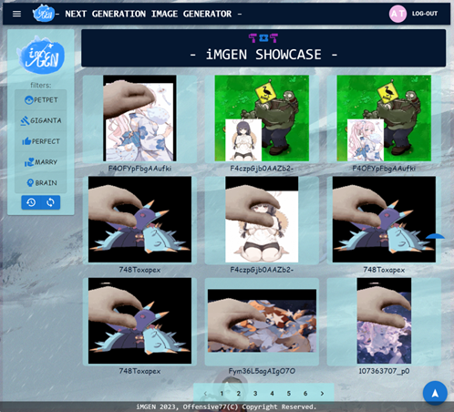
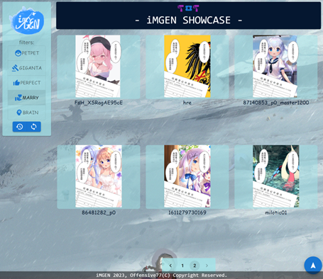
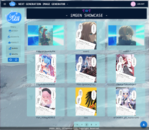
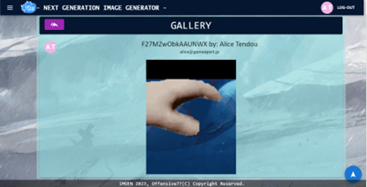

# iMGEN-frontend

## Introduction

This is the Frontend system for iMGEN: Next Generation Image Generator -- a meme image generator. This program is built upon `React.js` framework, uses `Next.js` for frontend router and relies `Material UI` on building up the user interface. This program should be used in conjunction with `iMGEN-backend`, which is the backend program of this. For which you should clone the codes in my another repo and run it on your server (or your personal computer, VM, etc. for testing).

## Before use
Update the public key in `Util.js`. (In accordance with which the private key should also be updated for the `iMGEN-backend`. See detailed info there.)

## Preview

### Home

### Sidebar

### Sign up

### Gallery

### iMGEN NOW!

### Profile

### iMGEN Display

### Premium Only

## Web Page on Show

Sponsor me and I could be able to run it on my server ;-).

## Thanks to

* React.js
* Next.js
* Material UI
* Encrypt.js
* Axios
